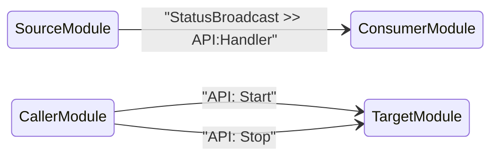

# CSM Module Documentation — AI Skill Guide

> **Purpose**: This document is a structured skill guide for AI assistants (e.g., GitHub Copilot, ChatGPT). It encodes all rules, conventions, and examples needed to **read**, **write**, and **validate** CSM module interface documentation automatically.

---

## 1. Background: What is a CSM Module?

A **CSM (Communicable State Machine) module** is a self-contained LabVIEW VI that implements the CSM framework pattern. Key characteristics:

- It is a **state machine** with named case branches (states).
- It communicates with other modules exclusively through **message strings**.
- It can **receive** messages (API calls) and **emit** messages (status broadcasts).
- It is designed to be reusable and independently testable.

Reference: <https://nevstop-lab.github.io/CSM-Wiki/>

---

## 2. Documentation File Convention

| Rule | Details |
| --- | --- |
| **One doc per module** | Each module VI named `Foo` must have a companion file `Foo.md` in the same repository. |
| **File naming** | Same name as the module, `.md` extension. Spaces allowed if the VI name uses them. |
| **Bilingual** | English primary (`Foo.md`), Chinese secondary (`Foo(CN).md`) when both are maintained. |
| **Template** | Start from [`module-template.md`](../module-template.md). |

---

## 3. Required Sections in Every Module Doc

When writing or generating a module documentation file, always include the following sections (mark N/A or remove only when explicitly noted as optional):

| Section | Required | Description |
| --- | --- | --- |
| **Brief Description** | ✅ Required | 1–3 sentences. What does the module do? |
| **Dependencies** | ✅ Required | CSM core + any add-ons needed |
| **API Interface** | ✅ Required | All `API:` messages the module accepts |
| **Status Broadcast Interface** | ✅ if module emits anything | All `Status`/`Interrupt` broadcasts |
| **Configuration** | ✅ if configurable | Front panel controls and/or INI keys |
| **Usage Constraints** | ✅ Required | Initialization order, singleton rules, etc. |
| **Usage Examples** | ✅ Required | At least one concrete message-string example |
| **Module Interaction Diagram** | Optional | Mermaid `stateDiagram-v2` showing message flows |
| **Notes** | Optional | Implementation notes and known limitations |

---

## 4. API Interface Rules

### 4.1 What counts as an "API"?

- Any case branch named with the prefix `API:` (e.g., `API: Start`, `API: Log`).
- Do **not** document internal states (`Initialize`, `Idle`, `Error Handler`, etc.) as API unless they are intentionally public.

### 4.2 Table columns

| Column | What to write |
| --- | --- |
| **API** | Exact message string including prefix, e.g., `` `API: Start` `` |
| **Description** | One sentence describing what the API does |
| **Arguments** | Data passed after `>>`. State the type explicitly. Write `N/A` if none. |
| **Response** | What the module sends back. Write `N/A` if none or async fire-and-forget. |

### 4.3 Argument type notation

Always write the type in parentheses after the value description:

```
Full path of data folder (Plain String)
1D Waveform array (MassData)
Cluster with settings (HexStr)
File path (${FilePath})   ← INI Static Variable
```

Supported types:

| Type | Notes |
| --- | --- |
| `Plain String` | Requires [CSM API String Arguments add-on](https://github.com/NEVSTOP-LAB/CSM-API-String-Arugments-Support) |
| `Safe String` | Built-in; special chars encoded as `%[HEX]` |
| `HexStr` | Built-in; Variant serialized to hex |
| `MassData` | Add-on; pass `Start:N,Size:M` |
| `${variable}` | Add-on; INI-backed variable name |

---

## 5. Status Broadcast Interface Rules

### 5.1 Status vs. Interrupt

| Broadcast type | When to use |
| --- | --- |
| `Status` | Normal, expected state transitions (e.g., "Acquired Waveform", "Logging Complete") |
| `Interrupt` | Errors, warnings, or events needing immediate attention |

### 5.2 Table columns

| Column | What to write |
| --- | --- |
| **Status** | Exact status string, e.g., `` `Acquired Waveform` `` |
| **Broadcast Type** | `Status` or `Interrupt` |
| **Description** | One sentence describing when this broadcast occurs |
| **Arguments** | Data passed with the broadcast; include type notation. Write `N/A` if none. |

### 5.3 Subscription syntax example

```text
// Register: route MyModule's "Acquired Waveform" into Processor's "API: Process"
Acquired Waveform@MyModule >> API: Process@Processor -><register>

// Unregister
Acquired Waveform@MyModule >> API: Process@Processor -><unregister>
```

---

## 6. Configuration Rules

### 6.1 Front panel controls

List every front-panel control that affects module behavior (not just cosmetic indicators). Include:
- Control name (as labeled on the front panel)
- LabVIEW data type
- Default value
- Effect on behavior

### 6.2 INI file keys

If the module reads an INI file, document:
- INI section header (usually the module name)
- Key names, default values, and descriptions

```ini
[ModuleName]
OutputFolder  = C:\Data   ; Root folder for output files
MaxRetries    = 3         ; Number of retries on error
```

---

## 7. CSM Message Syntax Reference

```text
// Local state (internal only, not externally callable)
DoSomething >> argument

// Async call — fire and forget
API: Start -> TargetModule

// Async call with argument
API: Configure >> argument -> TargetModule

// Async call, explicitly no reply
API: Log >> data ->| TargetModule

// Sync call — caller waits for response
API: GetValue -@ TargetModule

// Broadcast normal status to all subscribers
Status >> data -><status>

// Broadcast interrupt to all subscribers
Error >> message -><interrupt>

// Subscribe: link Src's status to Handler's API
Status@SourceModule >> API:Handler@HandlerModule -><register>

// Subscribe: treat Src's status as interrupt in Handler
Status@SourceModule >> API:Handler@HandlerModule -><register as Interrupt>

// Unsubscribe
Status@SourceModule >> API:Handler@HandlerModule -><unregister>
```

Full syntax: <https://github.com/NEVSTOP-LAB/Communicable-State-Machine/blob/main/.doc/Syntax.md>

---

## 8. Writing Usage Examples — Rules

1. **Use the module's actual runtime name** (the string argument passed when launching the module VI), not the VI file name. Note this in the example preamble.
2. Show at minimum:
   - The startup sequence (`Initialize` → `Start`)
   - At least one data-passing call
   - The shutdown sequence (`Stop`)
   - A subscription example (if the module broadcasts status)
3. Use comments (`//`) to annotate each step.
4. Wrap in a `text` code fence.

**Example:**

```text
// Suppose the module is launched with name "Logging"

// 1. Configure the output folder
API: Update Settings >> C:\Data -> Logging

// 2. Start logging
API: Start -> Logging

// 3. Log a waveform (MassData parameter format)
API: Log >> MassData-Start:89012,Size:1156 -> Logging

// 4. Stop logging
API: Stop -> Logging
```

---

## 9. Module Interaction Diagram — Rules

Use [Mermaid](https://mermaid.js.org/) `stateDiagram-v2` with `direction LR` to show inter-module message flows.



Rules:
- Each arrow label is the **forwarded message string** (the full state string that the consumer receives).
- Show only external-facing communications; omit internal states.

---

## 10. AI Generation Checklist

When generating a module documentation file from source code or a description, verify:

- [ ] File is named to match the module VI name.
- [ ] Brief Description answers "what does this module do?" in ≤ 3 sentences.
- [ ] Every `API:` case branch is listed in the API table.
- [ ] Argument types use the standard notation (e.g., `(Plain String)`, `(MassData)`).
- [ ] All `Status`/`Interrupt` broadcasts are listed in the Status table.
- [ ] Broadcast type is explicitly `Status` or `Interrupt` for each row.
- [ ] Configuration section covers all front-panel controls and INI keys.
- [ ] Usage Constraints includes initialization order and any singleton rules.
- [ ] At least one usage example with comments is included.
- [ ] All message strings in examples match the exact syntax: `API: Xxx >> args -> ModuleName`.
- [ ] Subscription example uses `-><register>` syntax correctly.
- [ ] Optional: Mermaid interaction diagram is present and syntactically correct.

---

## 11. Common Mistakes to Avoid

| Mistake | Correct approach |
| --- | --- |
| Documenting internal states as API | Only document `API:` prefixed cases |
| Omitting argument type | Always write `(Type)` in the Arguments column |
| Using wrong arrow for sync vs. async | Sync: `-@`, async: `->`, no-reply: `->|` |
| Forgetting `@ModuleName` in subscription | Always use `Status@Source >> API:Handler@Dest -><register>` |
| Missing N/A in empty cells | Write `N/A` explicitly when there are no arguments or no response |
| Using VI file name instead of runtime module name | Module name is the string used when launching; document this distinction |

---

## 12. Real-World Example Reference

For a complete, production-quality example of this documentation pattern, see:

- [`CSM-Continuous-Measurement-and-Logging` README (English)](https://github.com/NEVSTOP-LAB/CSM-Continuous-Meausrement-and-Logging/blob/main/README.md)
- [`CSM-Continuous-Measurement-and-Logging` README (Chinese)](https://github.com/NEVSTOP-LAB/CSM-Continuous-Meausrement-and-Logging/blob/main/README(CN).md)

That example documents three modules (`Logging Module`, `Acquisition Module`, `Algorithm Module`) with API tables, Status tables, and usage examples — exactly the pattern this skill encodes.

---

*CSM Wiki: <https://nevstop-lab.github.io/CSM-Wiki/>*
*CSM Core: <https://github.com/NEVSTOP-LAB/Communicable-State-Machine>*
