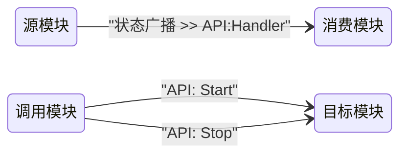

# CSM 模块文档编写规范 — AI 技能文档

> **目的**：本文档是面向 AI 助手（如 GitHub Copilot、ChatGPT）的结构化技能指南。它编码了**读取**、**编写**和**验证** CSM 模块接口文档所需的全部规则、约定和示例，使 AI 能够自动完成这些工作。

---

## 1. 背景：什么是 CSM 模块？

**CSM（可通信状态机，Communicable State Machine）模块**是一个实现了 CSM 框架模式的独立 LabVIEW VI。核心特征：

- 它是一个具有命名 case 分支（状态）的**状态机**。
- 它完全通过**消息字符串**与其他模块通信。
- 它可以**接收**消息（API 调用）和**发出**消息（状态广播）。
- 它被设计为可复用且可独立测试。

参考：<https://nevstop-lab.github.io/CSM-Wiki/>

---

## 2. 文档文件约定

| 规则 | 详细说明 |
| --- | --- |
| **每个模块一个文档** | 名为 `Foo` 的模块 VI 必须在同一仓库中有对应的 `Foo.md` 文件。 |
| **文件命名** | 与模块同名，扩展名为 `.md`。如果 VI 名称包含空格，文件名也可以包含空格。 |
| **模板** | 从 [`module-template.md`](../module-template.md) 开始填写。 |

### 2.1 文件头优先（Header-First）设计

模块文档采用**文件头优先**布局：文件头（标题 + 摘要引用块）位于第一条 `---` 分隔线之前，包含模块的全部关键信息；`---` 之后的章节提供完整的参数说明和使用示例。

```
# 模块名称 — CSM 模块接口文档      ← 文件头开始
                                          摘要引用块：
                                            功能描述
                                            模块信息表
                                            依赖项表
                                            API 接口一览
                                            状态广播一览
                                            属性一览
---                                    ← 文件头结束
## API 接口（详细说明）                ← 详细章节
## 状态广播接口
...
```

**AI 加载策略**：只需读取文件头（第一个 `---` 之前的内容）即可获取模块完整接口概况；如需了解某个接口的详细参数，再加载对应的详细章节。

**摘要引用块格式**：

````markdown
> **功能**：[一句话描述]。[可选补充。]
>
> | 属性           | 值          |
> | -------------- | ----------- |
> | LabVIEW 版本   | ≥ [版本]    |
> | 支持的操作系统 | [操作系统]  |
> | 支持 RT        | [✅ / ❌]   |
> | 支持 64-bit    | [✅ / ❌]   |
> | 所属模块组     | [模块组/N/A]|
>
> **依赖项**
>
> | 依赖 | 类型 |
> | --- | --- |
> | [依赖名](链接) | 必须 |
>
> **API 接口**：`API: Foo` · `API: Bar` · [其他]
>
> **状态广播**：`Status A`（Status）· `Error B`（Interrupt）<!-- 若无请删除 -->
>
> **属性**：`Attr A`（DBL，读写）· `Attr B`（Boolean，只读）<!-- 若无请删除 -->
````

---

## 3. 每个模块文档的必要章节

编写或生成模块文档时，始终包含以下章节（仅在明确标注为可选时才可省略）：

| 章节 | 是否必须 | 说明 |
| --- | --- | --- |
| **功能简述** | ✅ 必须 | 1～3 句话。模块做什么？ |
| **模块信息** | ✅ 必须 | LabVIEW 版本、操作系统、RT 支持等元数据 |
| **依赖项** | ✅ 必须 | CSM 核心框架 + 所需插件 |
| **API 接口** | ✅ 必须 | 模块接受的所有 `API:` 消息 |
| **状态广播接口** | ✅ 如果模块有广播 | 所有 `Status`/`Interrupt` 广播 |
| **属性接口** | ✅ 如果模块有对外属性 | 所有对外可读写的属性（使用 LabVIEW 数据类型，不是 CSM 参数类型） |
| **配置说明** | ✅ 如果可配置 | 前面板控件和/或 INI 键值 |
| **调用限制与注意事项** | ✅ 必须 | 初始化顺序、单例规则等 |
| **使用示例** | ✅ 必须 | 至少一个具体的消息字符串示例 |
| **模块交互图** | 可选 | 展示消息流的 Mermaid `stateDiagram-v2` |
| **备注** | 可选 | 实现说明和已知限制 |

### 3.1 模块信息格式

使用表格列出模块的运行环境元数据：

```markdown
## 模块信息

| 属性 | 值 |
| --- | --- |
| LabVIEW 版本 | ≥ [版本号，例如 2019] |
| 支持的操作系统 | [Windows / Linux / macOS] |
| 支持 RT | [✅ 支持 / ❌ 不支持] |
| 支持 64-bit | [✅ 支持 / ❌ 不支持] |
```

### 3.2 依赖项格式

使用 2 列表格（依赖名含链接，类型列标注必须/可选）：

```markdown
## 依赖项

| 依赖 | 类型 |
| --- | --- |
| [Communicable-State-Machine](https://github.com/NEVSTOP-LAB/Communicable-State-Machine) | 必须 |
| [CSM-API-String-Arguments-Support](https://github.com/NEVSTOP-LAB/CSM-API-String-Arguments-Support) | 可选 |
```

---

## 4. API 接口规则

### 4.1 什么算作"API"？

- 任何以 `API:` 为前缀命名的 case 分支（例如 `API: Start`、`API: Log`）。
- 或**没有 `:` 分割的非内置 case 分支**（例如用户自定义的 `ReadData`、`GetValue`）。
- **不要**将内置系统状态（`Macro: Initialize`、`Macro: Exit`、`Error Handler`、`Response`、`Async Response` 等）记录为 API，除非它们是有意公开的。

### 4.2 接口描述格式

每个 API 使用独立的三级段落（`###`），按以下结构填写：

````markdown
### `API: 名称`

一句话说明该 API 的作用。

- **参数**：`[CSM参数类型]` — `[数据类型]`：[数据描述]。无参数时写 `N/A`。
- **响应**：`[CSM参数类型]` — `[数据类型]`：[数据描述]。无响应时写 `N/A`。
````

对于包含多个字段的复合数据（如 Cluster），使用子列表展开：

````markdown
- **参数**：`HexStr` — `Cluster`：
  - `Flag`：Boolean
  - `Level`：DBL
````

### 4.3 参数类型标注规范

每个 `**参数**` / `**响应**` 行按以下模式填写：

```text
`[CSM参数类型]` — `[数据类型]`：[数据描述]
```

示例：

```text
`APIString` — `String`：配置文件路径
`MassData`  — `Waveform[]`：一维波形数组
`HexStr`    — `Cluster`：（见子列表）
`SafeStr`   — `String`：经 %[HEX] 编码的文件路径
```

> **注意**：接口文档中对 `String` 类型数据统一使用 `APIString` 标注（而非 `SafeStr`），因为 `SafeStr` 正是 `APIString` 针对 `String` 类型的内部实现。

支持的类型：

| 类型 | 备注 |
| --- | --- |
| `APIString` | 需要 [CSM API String Arguments 插件](https://github.com/NEVSTOP-LAB/CSM-API-String-Arguments-Support)；接口文档中对 `String` 类型数据统一使用此标注，因为 `SafeStr` 是 `APIString` 针对 `String` 类型的内部实现 |
| `SafeStr` | 内置；特殊字符编码为 `%[HEX]`。**接口文档中不直接使用 `SafeStr` 标注，统一改用 `APIString`** |
| `HexStr` | 内置；Variant 序列化为十六进制 |
| `MassData` | 插件；传递 `Start:N,Size:M` |
| `${变量名}` | 插件；INI 配置变量名 |

### 4.4 UI 模块内置接口

如果模块包含前面板（UI 模块），CSM 框架提供以下两个内置接口，可按需记录到文档中：

````markdown
### `UI: Front Panel State`

控制本模块前面板的显示状态。

- **参数**：`APIString` — `Enum`：`Open`、`Close` 或 `Minimize`
- **响应**：N/A

### `UI: Cursor Set`

设置前面板光标样式。

- **参数**：`APIString` — `Enum`：光标类型名称（如 `Busy`、`Default`）
- **响应**：N/A
````

---

## 5. 状态广播接口规则

### 5.1 Status 与 Interrupt 的区别

| 广播类型 | 使用场景 |
| --- | --- |
| `Status` | 正常的、预期中的状态转换（例如"Acquired Waveform"、"Logging Complete"） |
| `Interrupt` | 需要立即处理的错误、警告或事件 |

### 5.2 接口描述格式

每个状态广播使用独立的三级段落（`###`），按以下结构填写：

````markdown
### `状态名称`

**默认广播类型**：`Status`

一句话说明该广播何时发出。

- **参数**：广播携带的数据，包含类型标注。无参数时写 `N/A`。
````

> **广播类型说明**：文档中记录的广播类型是发布方的默认行为。订阅方可通过 `-><register as Interrupt>` 修改接收类型，因此广播类型是可以被外部覆盖的默认值。

### 5.3 订阅语法示例

```csm
// 注册：将 MyModule 的 "Acquired Waveform" 路由到 Processor 的 "API: Process"
Acquired Waveform@MyModule >> API: Process@Processor -><register>

// 以 Interrupt 类型接收（覆盖发布方的默认广播类型）
Acquired Waveform@MyModule >> API: Process@Processor -><register as Interrupt>

// 取消注册
Acquired Waveform@MyModule >> API: Process@Processor -><unregister>
```

---

## 6. 属性接口规则

### 6.1 什么是属性？

**属性（Attribute）** 是模块的配置数据，外部可通过 `CSM - Get Module Attribute.vi` / `CSM - Set Module Attribute.vi` 直接读写，无需发送消息。与 API 消息接口的核心区别在于：

- **API 参数**：传输的是字符串，需要使用 CSM 参数类型（`APIString`、`HexStr`、`SafeStr`、`MassData` 等）进行编解码。
- **属性参数**：直接使用 **LabVIEW 数据类型**（如 `String`、`Boolean`、`DBL`、`I32`），不需要任何 CSM 类型编解码。

属性是**可选的**：属性在被显式设置之前可能并不存在。读取一个不存在的属性时，`CSM - Get Module Attribute.vi` 的 `Found` 输出为 FALSE，并返回调用方指定的默认值，不会产生错误。因此，文档中应注明每个属性是否保证存在，以及缺省时的回退值。

> ⚠️ **重要**：Attribute 对外的接口，建议只使用简单的 LabVIEW 数据类型（如数值、布尔、字符串），而**不是** CSM 的参数类型。

### 6.2 接口描述格式

每个属性使用独立的三级段落（`###`），按以下结构填写：

````markdown
### `属性名称`

一句话说明该属性的含义和用途。

- **类型**：`[LabVIEW 数据类型]`（例如 `String`、`Boolean`、`DBL`、`I32`）
- **访问方式**：[读写 / 只读]
- **默认值**：[默认值，若无则写 N/A]
- **是否必须存在**：[必须 / 可选（不存在时使用默认值）]
````

示例：

````markdown
### `SampleRate`

当前的采样速率，单位为 Hz。

- **类型**：`DBL`
- **访问方式**：读写
- **默认值**：1000.0
- **是否必须存在**：可选（不存在时使用调用方指定的默认值）

### `IsRunning`

模块当前是否处于运行状态。

- **类型**：`Boolean`
- **访问方式**：只读
- **默认值**：FALSE
- **是否必须存在**：必须（由模块在 Macro: Initialize 中写入）
````

### 6.3 读写访问说明

| 访问方式 | 说明 |
| --- | --- |
| 读写 | 外部可通过 `CSM - Set Module Attribute.vi` 修改，也可通过 `CSM - Get Module Attribute.vi` 读取 |
| 只读 | 外部只能通过 `CSM - Get Module Attribute.vi` 读取，不应由外部写入（模块内部维护） |

### 6.4 属性可选性说明

读取属性时，属性不一定存在。调用 `CSM - Get Module Attribute.vi` 时：

- 如果属性存在，`Found` 输出为 TRUE，`Value` 输出为属性当前值。
- 如果属性不存在，`Found` 输出为 FALSE，`Value` 输出为调用方传入的 `Default Value`，**不产生错误**。

因此，在文档的 `**是否必须存在**` 字段中应注明：
- **必须**：模块保证该属性在初始化后一定存在（通常在 `Macro: Initialize` 中写入）。
- **可选**：该属性可能不存在，调用方应始终提供合理的默认值。

---

## 7. 配置说明规则

### 7.1 前面板控件

列出每一个影响模块行为的前面板控件（不包括纯显示指示器）。包含：
- 控件名称（与前面板标签一致）
- LabVIEW 数据类型
- 默认值
- 对行为的影响

### 7.2 INI 文件键值

如果模块读取 INI 文件，记录：
- INI 节名（通常为模块名称）
- 键名、默认值和说明

```ini
[模块名称]
OutputFolder  = C:\Data   ; 输出文件的根目录
MaxRetries    = 3         ; 出错后的重试次数
```

---

## 8. 调用限制与注意事项规则

使用 GitHub 支持的 `[!IMPORTANT]` 警告块列出所有限制条目，**不要使用 `- [ ]` checkbox 格式**。

```markdown
## 调用限制与注意事项

> [!IMPORTANT]
> - `API: Initialize` **必须**在其他任何 API 之前调用。
> - 本模块为**单例**——同一时间不可运行多个实例。
> - [在此添加其他顺序要求、线程安全说明或生命周期约束。]
```

规则：
- 每一条限制写在 `> -` 列表项中（每行以 `> ` 开头）。
- 内容应涵盖：初始化顺序、单例限制、线程安全以及任何生命周期约束。
- **禁止**使用 `- [ ]` 格式，否则 GitHub 会将其渲染为可勾选的 checkbox。

---

## 9. CSM 消息语法参考

```csm
// 本地状态（仅内部使用，不对外调用）
DoSomething >> 参数

// 异步调用——发出后不等待
API: Start -> 目标模块

// 带参数的异步调用
API: Configure >> 参数 -> 目标模块

// 无应答异步调用
API: Log >> 数据 ->| 目标模块

// 同步调用——调用方等待响应（通常推荐使用）
API: GetValue -@ 目标模块

// 向所有订阅者广播正常状态
Status >> 数据 -><status>

// 向所有订阅者广播中断状态
Error >> 消息 -><interrupt>

// 订阅：将源模块的状态链接到处理模块的 API
Status@源模块 >> API:Handler@处理模块 -><register>

// 订阅：将源模块的状态作为中断路由到处理模块
Status@源模块 >> API:Handler@处理模块 -><register as Interrupt>

// 取消订阅
Status@源模块 >> API:Handler@处理模块 -><unregister>
```

完整语法：<https://github.com/NEVSTOP-LAB/Communicable-State-Machine/blob/main/.doc/Syntax.md>

---

## 10. 编写使用示例的规则

1. 使用模块的**实际运行时名称**（启动模块 VI 时传入的字符串），而非 VI 文件名。在示例前说明这一点。
2. 至少展示：
   - 启动序列（`Initialize` → `Start`）
   - 至少一个传递数据的调用
   - 关闭序列（`Stop`）
   - 订阅示例（如果模块广播状态）
3. 用注释（`//`）标注每一步。
4. 使用 `csm` 代码围栏包裹（**不要**使用 `text`）。
5. **通常使用同步调用（`-@`）**，确保操作按序完成；根据需要可使用异步（`->`）或无应答（`->|`）等其他消息类型。

**示例：**

```csm
// 假设模块以名称 "Logging" 启动

// 1. 配置输出文件夹（同步调用，等待完成）
API: Update Settings >> C:\Data -@ Logging

// 2. 开始记录
API: Start -@ Logging

// 3. 记录一段波形数据（MassData 参数格式）
API: Log >> MassData-Start:89012,Size:1156 -@ Logging

// 4. 停止记录
API: Stop -@ Logging
```

---

## 11. 模块交互图规则

使用 [Mermaid](https://mermaid.js.org/) `stateDiagram-v2`，方向设为 `direction LR`，展示模块间消息流。



规则：
- 每个箭头标签是**转发的消息字符串**（消费者实际收到的完整状态字符串）。
- 只展示对外可见的通信；省略内部状态。

---

## 12. AI 生成检查清单

生成模块文档文件时，逐项验证：

- [ ] 文件名与模块 VI 名称一致。
- [ ] **文件头**（第一个 `---` 之前）包含完整的摘要引用块：功能描述、模块信息表、依赖项表、API 接口一览、状态广播一览（若有）、属性一览（若有）。
- [ ] 功能简述在 ≤ 3 句话内回答"这个模块做什么？"。
- [ ] 模块信息表包含 LabVIEW 版本、操作系统、RT 支持和 64-bit 支持。
- [ ] 依赖项使用 2 列表格（链接名 + 类型）。
- [ ] 每一个 `API:` case 分支都有独立的三级段落（`###`）。
- [ ] 每个 API 段落包含描述、`**参数**` 和 `**响应**` 字段（含 CSM 参数类型和数据描述）。
- [ ] 参数类型**不直接使用 `SafeStr`**；`String` 类型数据统一用 `APIString` 标注（`SafeStr` 是 `APIString` 针对 `String` 的内部实现）。
- [ ] 所有 `Status`/`Interrupt` 广播都有独立的三级段落（`###`）。
- [ ] 每个广播段落使用 `**默认广播类型**：` 标注类型（`Status` 或 `Interrupt`）。
- [ ] 如果模块有对外暴露的属性，每个属性都有独立的三级段落（`###`），包含类型（LabVIEW 数据类型）、访问方式、默认值和是否必须存在。
- [ ] 属性的类型使用 **LabVIEW 数据类型**（如 `String`、`DBL`、`Boolean`），**不是** CSM 参数类型。
- [ ] 每个属性注明 `**是否必须存在**`：必须（初始化后保证存在）或可选（可能不存在，调用方需提供默认值）。
- [ ] 配置说明涵盖所有前面板控件和 INI 键值。
- [ ] 调用限制说明包含初始化顺序和任何单例规则，且使用 `[!IMPORTANT]` 警告块格式（不使用 `- [ ]` checkbox）。
- [ ] 至少包含一个带注释的使用示例，使用 `csm` 代码围栏（**不使用 `text`**）。
- [ ] 示例中通常使用同步调用（`-@`）；根据需要可使用其他消息类型（`->`、`->|` 等）。
- [ ] 示例中所有消息字符串符合精确语法：`API: Xxx >> 参数 -@ 模块名称`（或其他合适的调用类型）。
- [ ] 订阅示例正确使用 `-><register>` 语法。
- [ ] 如果是 UI 模块，记录 `UI: Front Panel State` 和 `UI: Cursor Set` 内置接口。
- [ ] 可选：Mermaid 交互图存在且语法正确。

---

## 13. 常见错误对照表

| 错误 | 正确做法 |
| --- | --- |
| 将内部状态记录为 API | 只记录 API case（包括以 `API:` 为前缀的 case 和无 `:` 分隔的非内置 case） |
| 用表格列出 API 或广播 | 每个 API / 广播使用独立的 `###` 段落，描述在段落正文中 |
| 参数只写描述，不写 CSM 参数类型 | 始终使用 `` `[CSM参数类型]` — `[数据类型]`：[描述] `` 格式 |
| 参数类型直接使用 `SafeStr` | `String` 类型数据统一用 `APIString` 标注；`SafeStr` 是 `APIString` 针对 `String` 类型的内部实现，不在接口文档中直接出现 |
| 复合数据只写数据类型，不展开字段 | 使用子列表逐一列出 Cluster 的每个字段及其类型 |
| 订阅时忘写 `@模块名` | 始终使用 `Status@源模块 >> API:Handler@目标模块 -><register>` |
| 无参数或无响应时留空 | 明确写 `N/A` |
| 使用 VI 文件名代替运行时模块名 | 模块名是启动时传入的字符串；在文档中说明这一区别 |
| 依赖项使用 3 列表格或项目列表 | 改用 2 列表格（依赖名含链接 + 类型） |
| 属性类型使用 CSM 参数类型（如 `HexStr`、`APIString`） | 属性类型应为 LabVIEW 数据类型（如 `String`、`DBL`、`Boolean`），不需要 CSM 编解码 |
| 属性与 API 消息接口混淆 | 属性通过 `CSM - Get/Set Module Attribute.vi` 直接读写，不需要发送消息；API 通过消息字符串调用 |
| 假设属性一定存在而不处理 `Found = FALSE` 的情况 | 属性是可选的，读取时应始终提供合理的默认值，并根据 `Found` 输出决定是否使用默认值 |
| 调用限制与注意事项使用 `- [ ]` checkbox 格式 | 改用 `> [!IMPORTANT]` 警告块格式（GitHub 支持的 alert 语法），每条限制以 `> -` 开头 |
| 使用示例代码围栏使用 `text` | 改用 `csm` 代码围栏 |
| 使用示例中使用异步调用 `->` | 通常使用同步调用 `-@`；根据需要才使用 `->`、`->|` 等 |
| 广播类型字段使用 `**广播类型**：` | 改用 `**默认广播类型**：`；订阅方可通过 `-><register as Interrupt>` 修改接收类型 |

---

## 14. 真实示例参考

关于此文档模式的完整生产级示例，请参阅：

- [`CSM-Continuous-Measurement-and-Logging` README（英文）](https://github.com/NEVSTOP-LAB/CSM-Continuous-Measurement-and-Logging/blob/main/README.md)
- [`CSM-Continuous-Measurement-and-Logging` README（中文）](https://github.com/NEVSTOP-LAB/CSM-Continuous-Measurement-and-Logging/blob/main/README(CN).md)

该示例记录了三个模块（`Logging Module`、`Acquisition Module`、`Algorithm Module`），包含 API 表、状态表和使用示例——正是本技能文档所编码的模式。

---

*CSM Wiki：<https://nevstop-lab.github.io/CSM-Wiki/>*  
*CSM 核心框架：<https://github.com/NEVSTOP-LAB/Communicable-State-Machine>*
