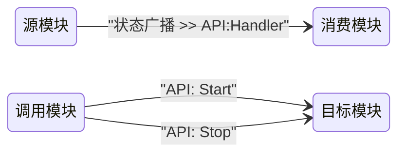

# CSM 模块文档编写规范 — AI 技能文档

> **目的**：本文档是面向 AI 助手（如 GitHub Copilot、ChatGPT）的结构化技能指南。它编码了**读取**、**编写**和**验证** CSM 模块接口文档所需的全部规则、约定和示例，使 AI 能够自动完成这些工作。

---

## 1. 背景：什么是 CSM 模块？

**CSM（可通信状态机，Communicable State Machine）模块**是一个实现了 CSM 框架模式的独立 LabVIEW VI。核心特征：

- 它是一个具有命名 case 分支（状态）的**状态机**。
- 它完全通过**消息字符串**与其他模块通信。
- 它可以**接收**消息（API 调用）和**发出**消息（状态广播）。
- 它被设计为可复用且可独立测试。

参考：<https://nevstop-lab.github.io/CSM-Wiki/>

---

## 2. 文档文件约定

| 规则 | 详细说明 |
| --- | --- |
| **每个模块一个文档** | 名为 `Foo` 的模块 VI 必须在同一仓库中有对应的 `Foo.md` 文件。 |
| **文件命名** | 与模块同名，扩展名为 `.md`。如果 VI 名称包含空格，文件名也可以包含空格。 |
| **模板** | 从 [`module-template.md`](../module-template.md) 开始填写。 |

---

## 3. 每个模块文档的必要章节

编写或生成模块文档时，始终包含以下章节（仅在明确标注为可选时才可省略）：

| 章节 | 是否必须 | 说明 |
| --- | --- | --- |
| **功能简述** | ✅ 必须 | 1～3 句话。模块做什么？ |
| **依赖项** | ✅ 必须 | CSM 核心框架 + 所需插件 |
| **API 接口** | ✅ 必须 | 模块接受的所有 `API:` 消息 |
| **状态广播接口** | ✅ 如果模块有广播 | 所有 `Status`/`Interrupt` 广播 |
| **配置说明** | ✅ 如果可配置 | 前面板控件和/或 INI 键值 |
| **调用限制与注意事项** | ✅ 必须 | 初始化顺序、单例规则等 |
| **使用示例** | ✅ 必须 | 至少一个具体的消息字符串示例 |
| **模块交互图** | 可选 | 展示消息流的 Mermaid `stateDiagram-v2` |
| **备注** | 可选 | 实现说明和已知限制 |

---

## 4. API 接口规则

### 4.1 什么算作"API"？

- 任何以 `API:` 为前缀命名的 case 分支（例如 `API: Start`、`API: Log`）。
- 或**没有 `:` 分割的非内置 case 分支**（例如用户自定义的 `ReadData`、`GetValue`）。
- **不要**将内置系统状态（`Macro: Initialize`、`Macro: Exit`、`Error Handler`、`Response`、`Async Response` 等）记录为 API，除非它们是有意公开的。

### 4.2 表格列说明

| **API** | **描述** | **参数数据类型** | **参数描述** | **响应数据类型** | **响应描述** |
| --- | --- | --- | --- | --- | --- |
| 完整消息字符串，包含前缀，例如 `` `API: Start` `` | 一句话说明该 API 的作用 | 参数的数据类型（例如 `APIString`、`MassData`、`${FilePath}` 等）。无参数时写 `N/A`。 | `>>` 之后传递的数据含义。无参数时写 `N/A`。 | 响应的数据类型。无响应或异步调用时写 `N/A`。 | 模块返回内容的含义。无响应或异步调用时写 `N/A`。 |

### 4.3 参数类型标注规范

始终在值描述之后用括号注明类型：

```text
数据文件夹的完整路径 (APIString)
一维波形数组 (MassData)
包含配置的簇 (HexStr)
文件路径 (SafeStr)   ← 由 INI 静态变量 `${FilePath}` 提供
```

支持的类型：

| 类型 | 备注 |
| --- | --- |
| `APIString` | 需要 [CSM API String Arguments 插件](https://github.com/NEVSTOP-LAB/CSM-API-String-Arguments-Support) |
| `SafeStr` | 内置；特殊字符编码为 `%[HEX]` |
| `HexStr` | 内置；Variant 序列化为十六进制 |
| `MassData` | 插件；传递 `Start:N,Size:M` |
| `${变量名}` | 插件；INI 配置变量名 |

---

## 5. 状态广播接口规则

### 5.1 Status 与 Interrupt 的区别

| 广播类型 | 使用场景 |
| --- | --- |
| `Status` | 正常的、预期中的状态转换（例如"Acquired Waveform"、"Logging Complete"） |
| `Interrupt` | 需要立即处理的错误、警告或事件 |

### 5.2 表格列说明

| 列 | 填写内容 |
| --- | --- |
| **状态** | 精确的状态字符串，例如 `` `Acquired Waveform` `` |
| **广播类型** | `Status` 或 `Interrupt` |
| **描述** | 一句话说明该广播何时发出 |
| **参数** | 广播携带的数据，包含类型标注。无参数时写 `N/A`。 |

### 5.3 订阅语法示例

```text
// 注册：将 MyModule 的 "Acquired Waveform" 路由到 Processor 的 "API: Process"
Acquired Waveform@MyModule >> API: Process@Processor -><register>

// 取消注册
Acquired Waveform@MyModule >> API: Process@Processor -><unregister>
```

---

## 6. 配置说明规则

### 6.1 前面板控件

列出每一个影响模块行为的前面板控件（不包括纯显示指示器）。包含：
- 控件名称（与前面板标签一致）
- LabVIEW 数据类型
- 默认值
- 对行为的影响

### 6.2 INI 文件键值

如果模块读取 INI 文件，记录：
- INI 节名（通常为模块名称）
- 键名、默认值和说明

```ini
[模块名称]
OutputFolder  = C:\Data   ; 输出文件的根目录
MaxRetries    = 3         ; 出错后的重试次数
```

---

## 7. CSM 消息语法参考

```text
// 本地状态（仅内部使用，不对外调用）
DoSomething >> 参数

// 异步调用——发出后不等待
API: Start -> 目标模块

// 带参数的异步调用
API: Configure >> 参数 -> 目标模块

// 无应答异步调用
API: Log >> 数据 ->| 目标模块

// 同步调用——调用方等待响应
API: GetValue -@ 目标模块

// 向所有订阅者广播正常状态
Status >> 数据 -><status>

// 向所有订阅者广播中断状态
Error >> 消息 -><interrupt>

// 订阅：将源模块的状态链接到处理模块的 API
Status@源模块 >> API:Handler@处理模块 -><register>

// 订阅：将源模块的状态作为中断路由到处理模块
Status@源模块 >> API:Handler@处理模块 -><register as Interrupt>

// 取消订阅
Status@源模块 >> API:Handler@处理模块 -><unregister>
```

完整语法：<https://github.com/NEVSTOP-LAB/Communicable-State-Machine/blob/main/.doc/Syntax.md>

---

## 8. 编写使用示例的规则

1. 使用模块的**实际运行时名称**（启动模块 VI 时传入的字符串），而非 VI 文件名。在示例前说明这一点。
2. 至少展示：
   - 启动序列（`Initialize` → `Start`）
   - 至少一个传递数据的调用
   - 关闭序列（`Stop`）
   - 订阅示例（如果模块广播状态）
3. 用注释（`//`）标注每一步。
4. 使用 `text` 代码围栏包裹。

**示例：**

```text
// 假设模块以名称 "Logging" 启动

// 1. 配置输出文件夹
API: Update Settings >> C:\Data -> Logging

// 2. 开始记录
API: Start -> Logging

// 3. 记录一段波形数据（MassData 参数格式）
API: Log >> MassData-Start:89012,Size:1156 -> Logging

// 4. 停止记录
API: Stop -> Logging
```

---

## 9. 模块交互图规则

使用 [Mermaid](https://mermaid.js.org/) `stateDiagram-v2`，方向设为 `direction LR`，展示模块间消息流。



规则：
- 每个箭头标签是**转发的消息字符串**（消费者实际收到的完整状态字符串）。
- 只展示对外可见的通信；省略内部状态。

---

## 10. AI 生成检查清单

生成模块文档文件时，逐项验证：

- [ ] 文件名与模块 VI 名称一致。
- [ ] 功能简述在 ≤ 3 句话内回答"这个模块做什么？"。
- [ ] 每一个 `API:` case 分支都列在 API 表中。
- [ ] 参数类型使用标准标注格式（例如 `(APIString)`、`(MassData)`）。
- [ ] 所有 `Status`/`Interrupt` 广播都列在状态广播表中。
- [ ] 每行明确标注广播类型为 `Status` 或 `Interrupt`。
- [ ] 配置说明涵盖所有前面板控件和 INI 键值。
- [ ] 调用限制说明包含初始化顺序和任何单例规则。
- [ ] 至少包含一个带注释的使用示例。
- [ ] 示例中所有消息字符串符合精确语法：`API: Xxx >> 参数 -> 模块名称`。
- [ ] 订阅示例正确使用 `-><register>` 语法。
- [ ] 可选：Mermaid 交互图存在且语法正确。

---

## 11. 常见错误对照表

| 错误 | 正确做法 |
| --- | --- |
| 将内部状态记录为 API | 只记录 API case（包括以 `API:` 为前缀的 case 和无 `:` 分隔的非内置 case） |
| 省略参数类型 | 始终在参数列写 `(类型)` |
| 同步/异步箭头用错 | 同步：`-@`，异步：`->`，无应答：`->|` |
| 订阅时忘写 `@模块名` | 始终使用 `Status@源模块 >> API:Handler@目标模块 -><register>` |
| 空单元格不写 N/A | 无参数或无响应时明确写 `N/A` |
| 使用 VI 文件名代替运行时模块名 | 模块名是启动时传入的字符串；在文档中说明这一区别 |

---

## 12. 真实示例参考

关于此文档模式的完整生产级示例，请参阅：

- [`CSM-Continuous-Measurement-and-Logging` README（英文）](https://github.com/NEVSTOP-LAB/CSM-Continuous-Measurement-and-Logging/blob/main/README.md)
- [`CSM-Continuous-Measurement-and-Logging` README（中文）](https://github.com/NEVSTOP-LAB/CSM-Continuous-Measurement-and-Logging/blob/main/README(CN).md)

该示例记录了三个模块（`Logging Module`、`Acquisition Module`、`Algorithm Module`），包含 API 表、状态表和使用示例——正是本技能文档所编码的模式。

---

*CSM Wiki：<https://nevstop-lab.github.io/CSM-Wiki/>*  
*CSM 核心框架：<https://github.com/NEVSTOP-LAB/Communicable-State-Machine>*
