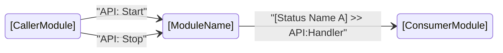

# `[ModuleName]` — CSM Module Interface Document

> **How to use this template**
> 1. Copy this file and rename it to match your module (e.g., `DataLogger.md`).
> 2. Replace every `[placeholder]` with real content.
> 3. Remove sections that do not apply to your module.
> 4. Delete this instruction block when done.

[English](./[ModuleName].md) | [中文](./[ModuleName](CN).md)

---

## Brief Description

`[ModuleName]` is a CSM module that [one-sentence description of what it does].

[Optional: 1–2 more sentences on its main design goals or the problem it solves.]

---

## Dependencies

| Dependency | Type | Link |
| --- | --- | --- |
| Communicable State Machine (CSM) | Required | [GitHub](https://github.com/NEVSTOP-LAB/Communicable-State-Machine) |
| [e.g., CSM MassData Parameter Support] | Required / Optional | [GitHub](https://github.com/NEVSTOP-LAB/CSM-MassData-Parameter-Support) |

> Remove rows that do not apply.

---

## API Interface (Message Interface)

These are the messages external callers can send to this module.

| API | Description | Arguments | Response |
| --- | --- | --- | --- |
| `API: Initialize` | Initialize internal resources. Must be called before any other API. | Configuration file path `(Plain String)` | N/A |
| `API: Start` | Begin the module's main operation. | N/A | N/A |
| `API: Stop` | Stop the main operation gracefully. | N/A | N/A |
| `API: Update Settings` | Update runtime settings without restarting. | Settings string or path `(Plain String)` | N/A |
| `API: Get Status` | Synchronously query the current status. | N/A | Status description `(Plain String)` |

> Add or remove rows as needed. Document every externally callable `API:` message.

### Argument Type Reference

| Type | Description |
| --- | --- |
| `Plain String` | Requires [CSM API String Arguments](https://github.com/NEVSTOP-LAB/CSM-API-String-Arugments-Support) add-on |
| `Safe String` | Special characters encoded as `%[HEXCODE]`; built-in |
| `HexStr` | Data converted to Variant → Hex string; built-in |
| `MassData` | Memory-mapped buffer; pass `Start:N,Size:M`; requires [MassData add-on](https://github.com/NEVSTOP-LAB/CSM-MassData-Parameter-Support) |
| `${variable}` | INI-backed variable; requires [INI Static Variable add-on](https://github.com/NEVSTOP-LAB/CSM-INI-Static-Variable-Support) |

---

## Status Broadcast Interface

These are the messages this module **emits** to notify subscribers of internal state changes.

| Status | Broadcast Type | Description | Arguments |
| --- | --- | --- | --- |
| `[Status Name A]` | `Status` | [What happened / what data is ready] | [Type and format] |
| `[Status Name B]` | `Interrupt` | [Error or interrupt-level event description] | Error message `(Plain String)` |

> - Use **`Status`** for normal, expected state transitions.
> - Use **`Interrupt`** for errors or events that need immediate attention.
> - Remove this section if the module broadcasts nothing.

---

## Configuration

### Front Panel Parameters

| Control | Type | Default | Description |
| --- | --- | --- | --- |
| `[Control Name]` | [LabVIEW Type] | [Default value] | [What it configures] |

### INI File Settings

If the module reads an INI file, document the section and keys here.

```ini
[[ModuleName]]
[KeyName]     = [DefaultValue]    ; [Description]
[AnotherKey]  = [DefaultValue]    ; [Description]
```

> Remove this section if the module has no configurable parameters.

---

## Usage Constraints

- [ ] `API: Initialize` **must** be called before any other API.
- [ ] This module is a **singleton** — do not run more than one instance at the same time.
- [ ] [Add any other ordering, threading, or lifecycle requirements here.]

---

## Usage Examples

> Replace `[ModuleName]` with the actual name used when the module VI is launched.

### Basic lifecycle

```text
// Start the module
API: Initialize >> C:\config\settings.ini -> [ModuleName]
API: Start -> [ModuleName]

// ... do work ...

// Stop the module
API: Stop -> [ModuleName]
```

### Subscribing to status broadcasts

```text
// Route [ModuleName]'s "[Status Name A]" into another module's handler
[Status Name A]@[ModuleName] >> API:On[Status Name A]@[HandlerModule] -><register>

// Unsubscribe when done
[Status Name A]@[ModuleName] >> API:On[Status Name A]@[HandlerModule] -><unregister>
```

### Sync call

```text
// Get the current status synchronously (caller waits for response)
API: Get Status -@ [ModuleName]
```

---

## Module Interaction Diagram



> Remove or update this diagram to reflect actual module interactions.

---

## Notes

- [Any implementation notes, known limitations, or gotchas for developers.]

---

*For the full CSM syntax reference, see: <https://github.com/NEVSTOP-LAB/Communicable-State-Machine/blob/main/.doc/Syntax.md>*
*CSM Wiki: <https://nevstop-lab.github.io/CSM-Wiki/>*
